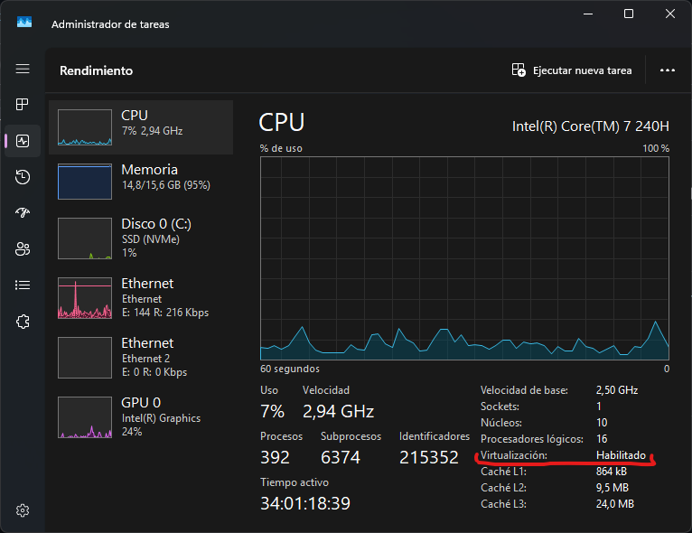
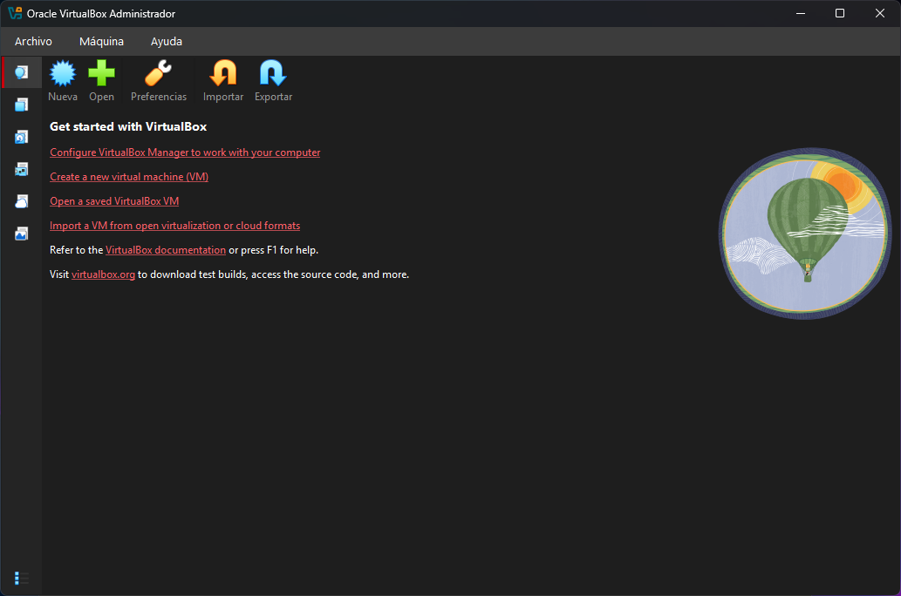
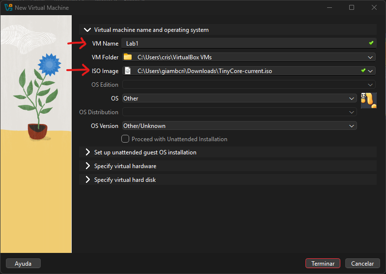
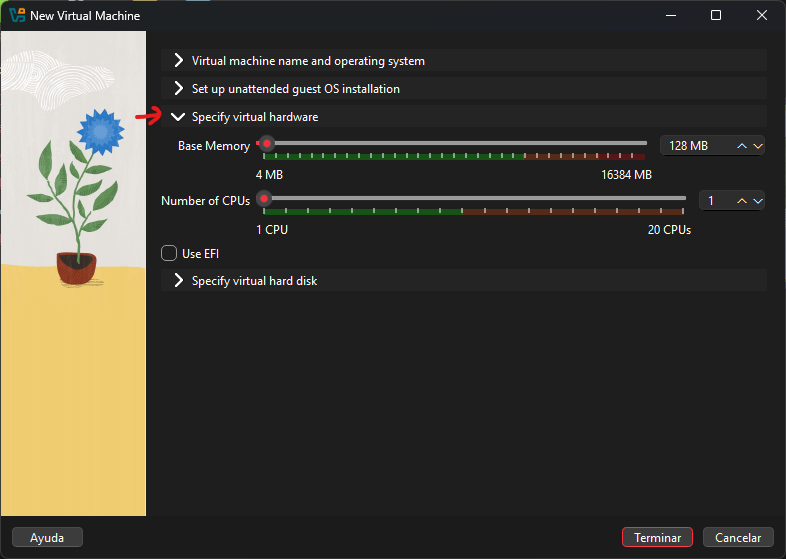
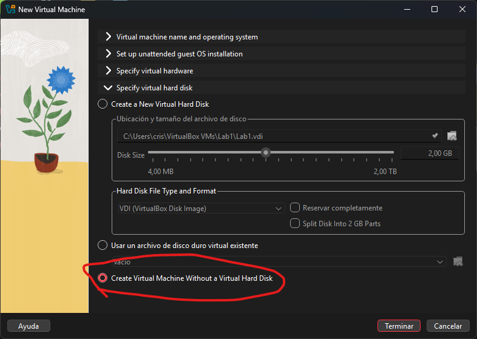
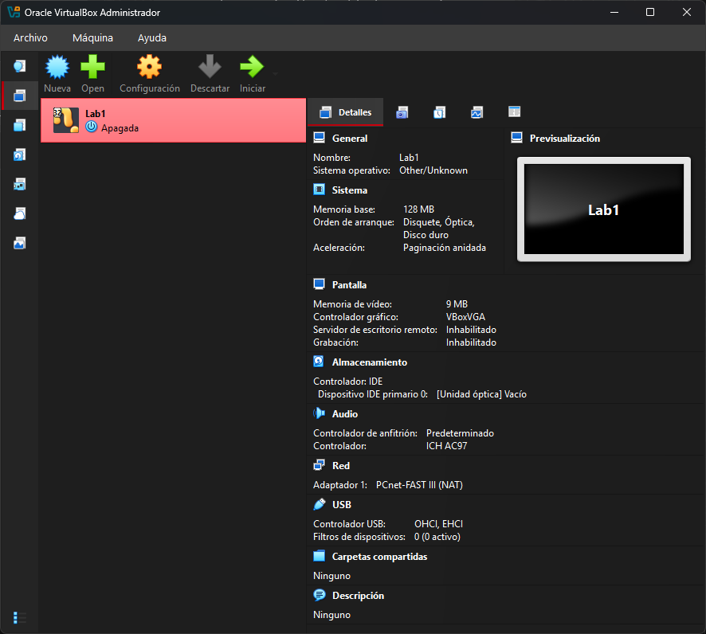
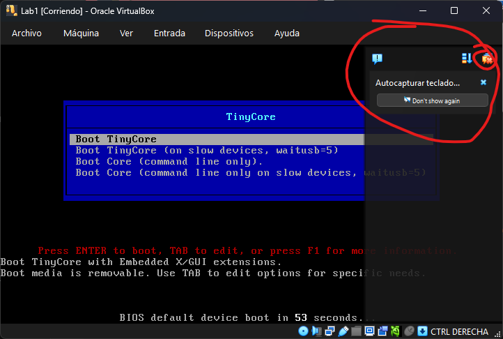
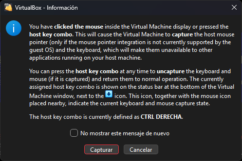
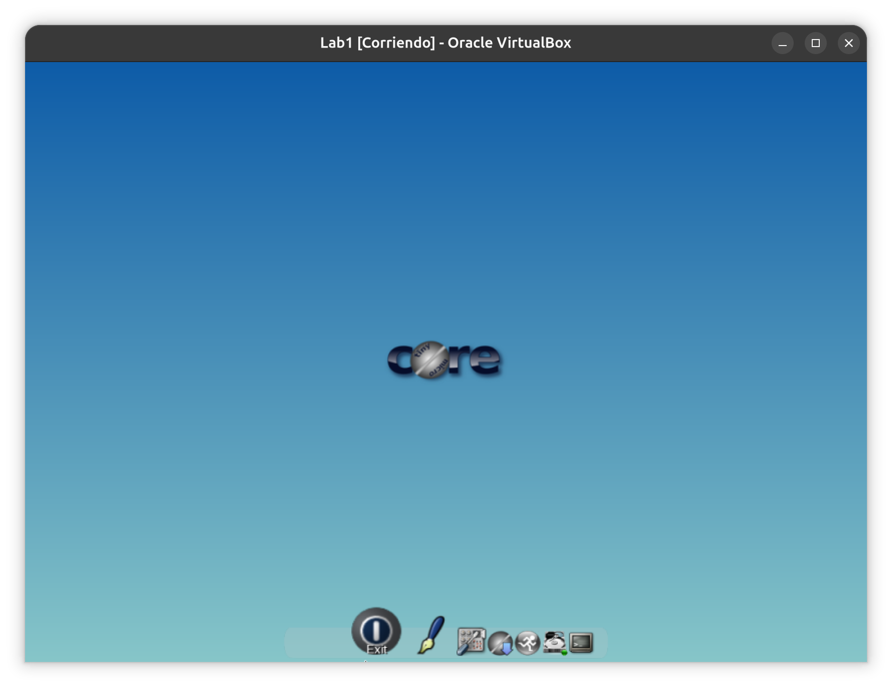

# Laboratorio 1 - Máquinas virtuales

## Objetivo

  - Instalar VirtualBox (hipervisor tipo 2)
  - Ver conceptos básicos de virtualización
  - Creación de una máquina virtual

### En este lab usaremos TinyCore Linux

[**TinyCore Linux**](http://www.tinycorelinux.net/) es una distro minimalista pensada justo para verificar rápido que un entorno arranca bien, sin peso.

Imagen base de ~21 MB.
Arranca en RAM: corre todo desde memoria, así que bootea en segundos incluso con recursos mínimos.

## 0. Preparación del Entorno

Primero, vamos a verificar que nuestra computadora soporte y tenga habilidado las instrucciones de virtualización AMD-V o VT-x para procesadores AMD e Intel respectivamente.


#### En Windows

- Vamos al administrador de tareas.
- Rendimiento > CPU.
- Abajo a la derecha, entre las distintas características del procesador deberíamos ver `Virtualización`.
- Debería estar `Habilitado`.

    


#### En GNU/Linux

Con el siguiente comando podemos ver si tenemos habilitada la virtualización:

```bash
lscpu | grep -i virtuali
```

##### Deberías ver algo así

```bash

Virtualization:         AMD-V   # Para procesadores AMD
---
Virtualization:         VT-x    # Para procesadores Intel    
```

### Virtualización deshabilitada

Algunos fabricantes deshabilitan por defecto la virtualización del procesador. Para activarlo manualmente, debemos reiniciar la computadora, entrar a la BIOS y buscar la opción para habilitar `VT-x`, `SVM` o `Virtualization` en las opciones avanzadas del CPU. Dichas opciones cambian según fabricante. Actualmente todos los procesadores soportan instrucciones de virtualización en el procesador, por lo que debería ser solo de configuración.


## 1. Descargamos Virtualbox

Vamos a descargar del sitio oficial el instalador de Virtualbox en [este link](https://www.virtualbox.org/wiki/Downloads).


- Seguir los pasos según su sistema operativo: En Windows suele ser descargar el instalador y dar todo siguiente.
- En alguna distro de Linux, ver las instruccioines [acá](https://www.virtualbox.org/wiki/Linux_Downloads). Hay varias opciones; se puede descargar el `.deb` (Debian/Ubuntu), `.rpm` (para distros Oracle/RHEL) o descargarlo agregando los repositorios oficiales.
- Si descargaste el `.deb` lo podés instalar con el siguiente comando:
    ```bash
    sudo apt install ./virtualbox-7.2*.deb
    ```
- Una vez instalado reiniciar la computadora.

### Opcional: Descargar Extension Pack

Opcionalmente podemos descargar las VirtualBox Extension Pack.
El Extension Pack es un paquete binario complementario que añade funciones avanzadas a VirtualBox (como soporte para USB 2.0/3.0, cifrado de imágenes de disco, arranque por NVMe y el servidor RDP integrado llamado VRDP); se distribuye bajo la Licencia de Uso Personal y Evaluación de VirtualBox **(PUEL)**, la cual permite su uso gratuito únicamente para fines estrictamente personales, educativos o de evaluación temporal sin fines comerciales, prohibiendo expresamente su despliegue operativo en empresas o con propósitos comerciales sin haber adquirido antes una licencia comercial de pago con Oracle.

Para nuestro curso, su descarga es opcional.
Una vez descargado debe ejecutarse, aceptar la licencia y se instala automáticamente sobre VirtualBox.

En sistemas Linux, además debe agregarse al usuario como miembro de `vboxusers` para tener compatibilidad.

```bash
sudo usermod -aG vboxusers $USER
# Luego de aplicar ese cambio, será necesario reiniciar la sesión.
```

## 2. Iniciando Virtualbox

Al iniciar VirtualBox, si todo está bien debería abrir la siguiente ventana:




## 3. Creando una VM


1. Vamos a descargar una `iso` que es para probar la VM. Usaremos la distro [TinyCore](http://www.tinycorelinux.net). Descargaremos desde [acá](http://www.tinycorelinux.net/17.x/x86/release/TinyCore-current.iso).

2. La nueva VM la llamaremos `Lab1` y cargaremos la imágen ISO de **TinyCore** que hemos descargado.



3. Le especificaremos los recursos de hardware virtual a `128 MB` de RAM y 1 `vCPU`.



4. Crearemos una VM *sin disco rígido virtual* ya que para esta prueba usaremos una imágen booteable desde una ISO. Y hacemos clic en **Terminar**.



5. Si hicimos todo bien, nos devolvera a la *Home* de VirtualBox donde podremos ver nuestra VM `Lab1` creada.




## 4. Iniciando una VM

1. En la *Home* de VirtualBox seleccionaremos `Lab1` y haremos clic en **Iniciar**

2. Aparecerá una nueva ventana mostrando la BIOS de VirtualBox y luego el sistema booteará desde la ISO de `TinyCore`. Nos mostrará una advertencia que se autocapturará el teclado, le damos cerrar como muestra la imágen.



3. Luego, al hacer clic nos aparecerá el siguiente mensaje:



Nos está avisando que la VM va a capturar el teclado y mouse de nuestra computadora, por lo que **todo lo que tecleemos o movamos el cursor** lo hará dentro de la máquina virtual.

Si queremos salir, tenemos que apretar **CONTROL DERECHO** (La tecla control que está a la derecha del teclado).

>Si entendimos eso, podemos darle a **No mostrar mas este mensaje**.


## 5. Nuestra VM Iniciada

1. Automáticamente booteará desde la ISO y arrancará **TinyCore**.



2. Podemos probar como se comporta la máquina virtual, pero es un sistema mínimo solo de prueba.

3. Apagaremos la VM:
    - En el Home de VirtualBox, botón derecho sobre `Lab1`.
    - Stop > Apagar
    - Nos aparecerá una advertencia que estamos apagando la VM sin el procedimiento de apagado. Aceptaremos la advertencia para proceder con el apagado.


## Resumen de Lab

En este laboratorio vimos los conceptos básicos de virtualización: cómo verificar que el procesador soporte y tenga habilitadas las instrucciones de virtualización (AMD-V / VT-x), instalamos VirtualBox como hipervisor tipo 2 y creamos nuestra primera máquina virtual (`Lab1`) con recursos mínimos de hardware (128 MB de RAM y 1 vCPU). Finalmente, booteamos la VM desde una imagen ISO de TinyCore Linux sin disco rígido virtual, y aprendimos a iniciarla y apagarla correctamente desde VirtualBox.

## Links útiles

- [Apuntes teóricos](https://linux.idepba.com.ar/clase2.html)
- [Guía adminitrador Virtualbox](https://download.virtualbox.org/virtualbox/7.2.8/SDKRef.pdf)

-----

<p align="center"\>

</p\>

