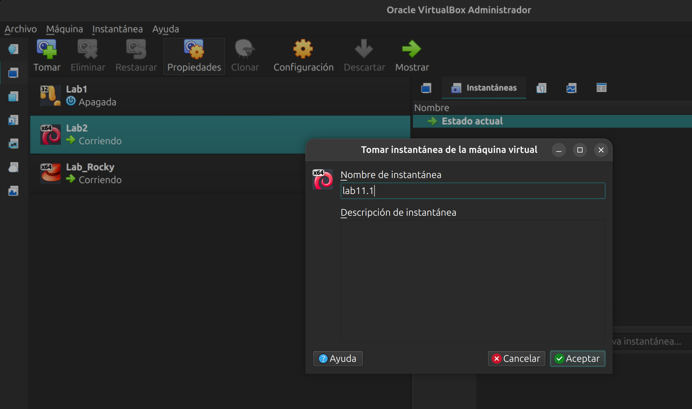
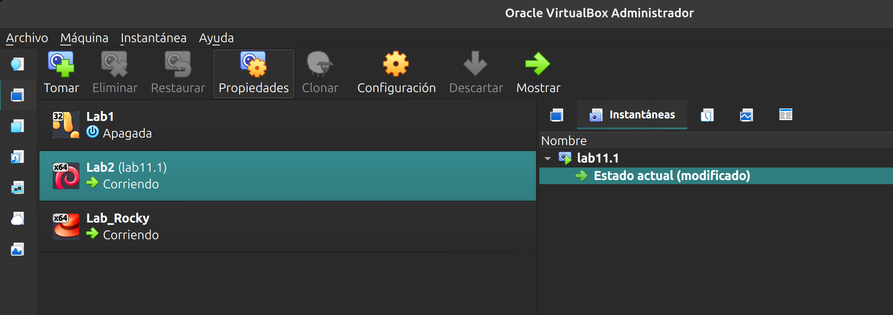
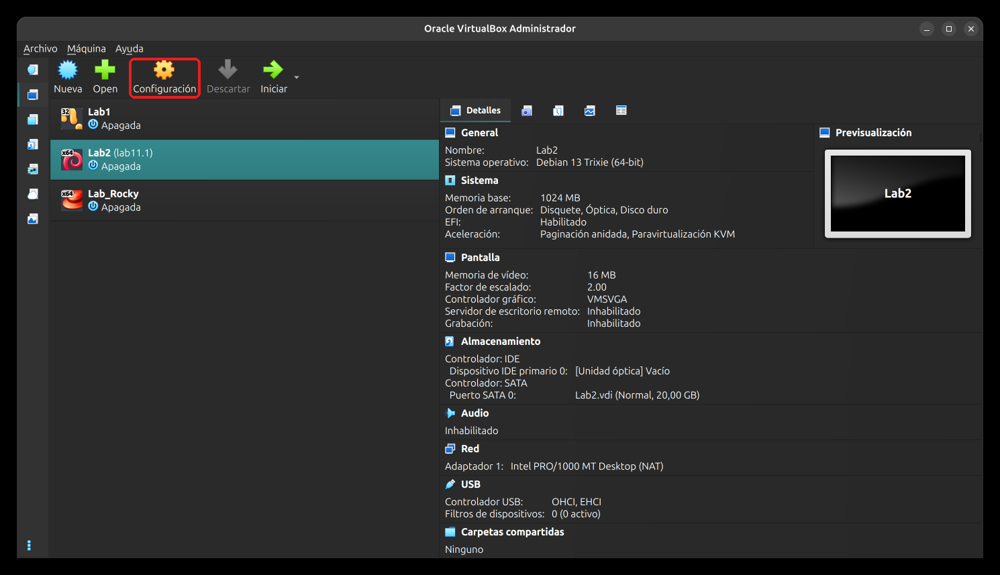
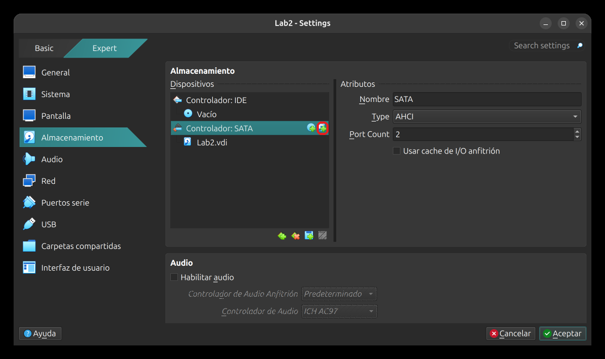
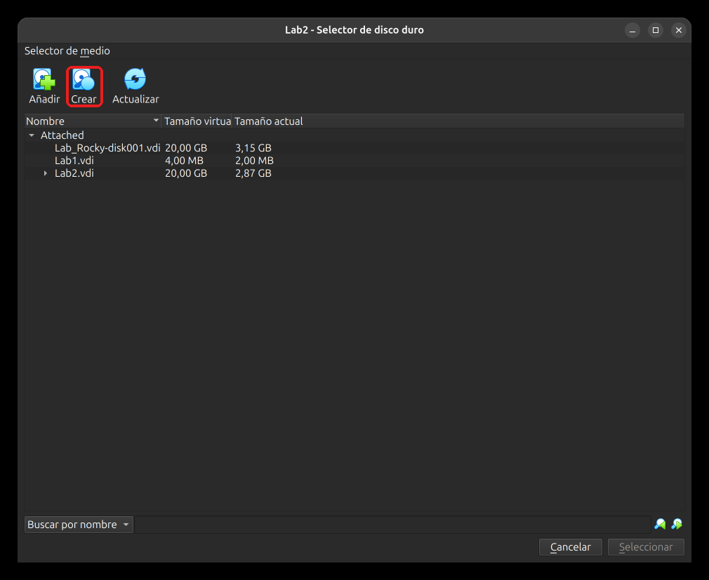
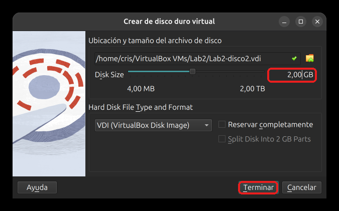
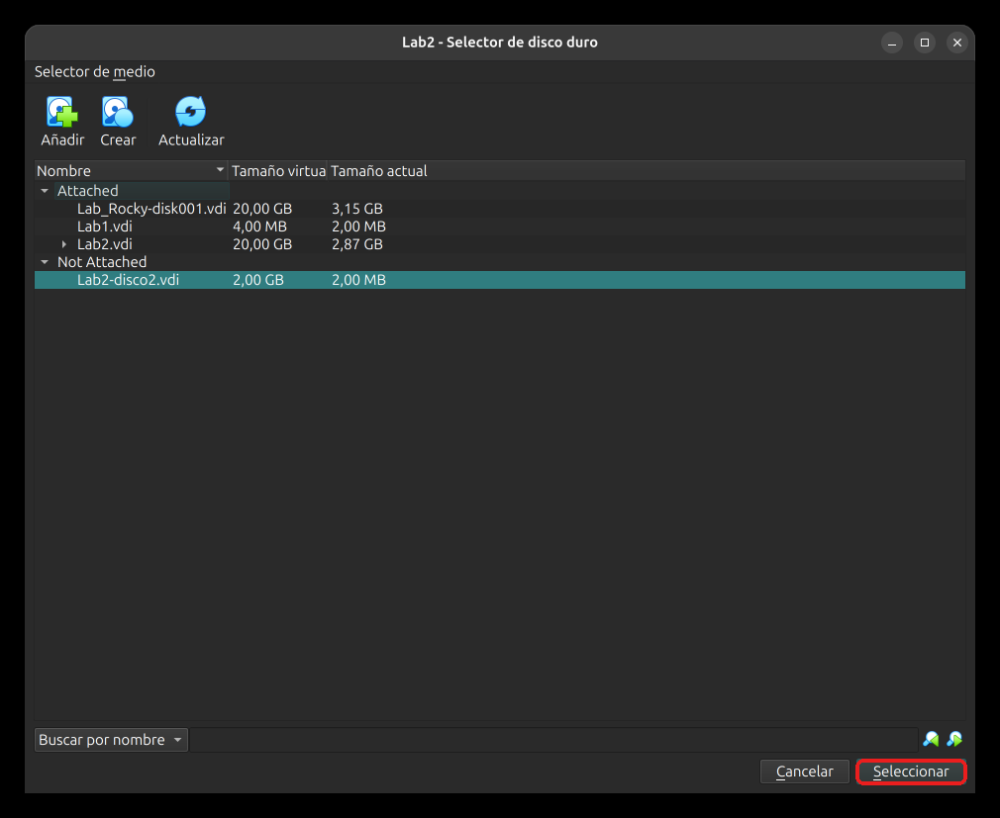
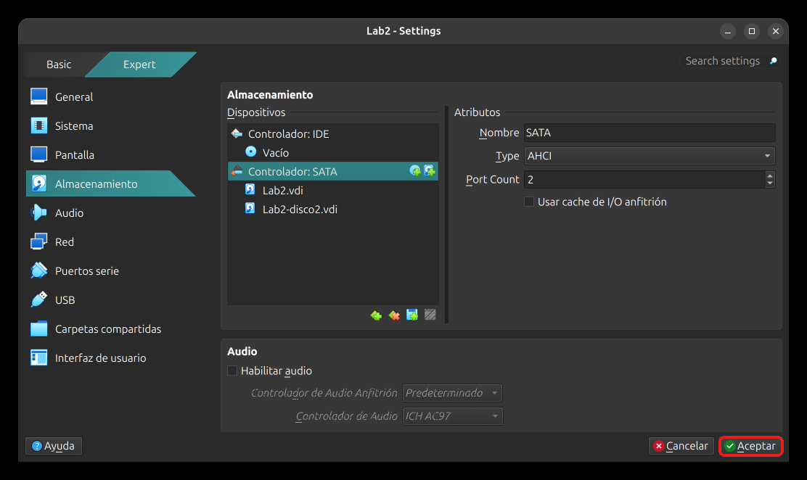

# Laboratorio 11.2 - Agregar un disco

## Objetivo

- Agregar un disco de 2 GB a la VM, particionarlo y formatearlo en ext4.
- Montarlo en `/srv/datos` a mano y dejarlo montado en cada arranque con una línea de `fstab` por UUID.
- Ver inodos, *hard link* y *symbolic link* sobre el disco nuevo.
- Opcional: probar una línea de `fstab` con error y recuperar un arranque roto desde GRUB.

### Punto de partida

Usamos la VM Debian 13 del curso y la cuenta administradora con `sudo`, por ejemplo `cristian`. **Alcanza con tener la VM instalada y el acceso por SSH del [Laboratorio 3](../lab3/lab3.md).** Conviene haber hecho antes el [Laboratorio 11.1](lab11.1.md), pero no es obligatorio.

> [!IMPORTANT]
> Antes de cambiar nada, sacá una instantánea de la VM (paso 1). En la parte opcional rompemos el arranque a propósito, y con la instantánea volvés atrás sin esfuerzo.

> [!NOTE]
> Reemplazá `cristian` por tu usuario habitual. Los nombres de disco pueden cambiar entre arranques cuando la VM tiene dos discos: el del sistema puede aparecer como `sda` o como `sdb`. En este laboratorio identificamos siempre el disco nuevo por su tamaño (2G) y no damos por sentado ningún nombre. Usá los de tu `lsblk`.

## 0. Preparación

Desde la máquina anfitriona:

```bash
ssh -p 2222 cristian@localhost
```

```bash
hostname
lsblk
```

Tiene que aparecer `lab2-vm` (o el nombre que le hayas dado). `lsblk` muestra el disco del sistema y todavía no el nuevo:

```text
NAME   MAJ:MIN RM  SIZE RO TYPE MOUNTPOINTS
sda      8:0    0   20G  0 disk 
├─sda1   8:1    0  967M  0 part /boot/efi
└─sda2   8:2    0 19,1G  0 part /
sr0     11:0    1 1024M  1 rom  
```

Esta salida es la de una VM que ya pasó por el Laboratorio 11.1: `sda2` de 19,1G y sin `sda3`. Si todavía no lo hiciste, vas a ver también la swap `sda3` y `sda2` de 18,1G.

## 1. Sacar una instantánea

Apagá la VM:

```bash
sudo systemctl poweroff
```

En VirtualBox, seleccioná la VM `Lab2`, abrí la pestaña **Instantáneas**, apretá **Tomar**, poné un nombre, por ejemplo `lab11.2`, y aceptá.



Después de aceptar, la lista muestra tu instantánea y debajo el **Estado actual**.



Para volver atrás: con la VM apagada, seleccioná la instantánea y apretá **Restaurar**.

## 2. Agregar el disco en VirtualBox

Con la VM apagada, seleccioná `Lab2` en la lista y apretá **Configuración**.



En la ventana de configuración, entrá en **Almacenamiento**, seleccioná el **Controlador: SATA** y apretá el segundo ícono que aparece a la derecha de su nombre, el de agregar un disco duro.



Se abre el **Selector de disco duro**. La lista muestra los discos que ya existen, y ninguno es para este uso, así que apretá **Crear**.



En el asistente dejá el formato **VDI** y la casilla **Reservar completamente** sin marcar, para que el archivo crezca a medida que se usa. Poné el nombre `Lab2-disco2` al final de la ubicación y un **Disk Size** de **2,00 GB**. Después apretá **Terminar**.



Volvés al selector, donde el disco nuevo aparece en la sección **Not Attached**. Con `Lab2-disco2.vdi` seleccionado, apretá **Seleccionar**.



En **Almacenamiento**, el controlador SATA ahora lista `Lab2.vdi` y `Lab2-disco2.vdi`. Apretá **Aceptar** para guardar.



> [!NOTE]
> El disco SATA de la VM no admite conexión en caliente, por eso hay que agregarlo con la VM apagada. Parte de la interfaz de VirtualBox aparece en inglés (`Settings`, `Disk Size`, `Port Count`) aunque el resto esté en español. Si en tu controlador SATA el valor de **Port Count** está en 1, subilo a 2 antes de agregar el disco.

Si preferís la línea de comandos, esto hace lo mismo, desde la máquina anfitriona (cambiá la ruta si tu VM está en otra carpeta):

```bash
cd "$HOME/VirtualBox VMs/Lab2"
VBoxManage createmedium disk --filename "$PWD/Lab2-disco2.vdi" --size 2048
VBoxManage storageattach Lab2 --storagectl SATA --port 1 --device 0 --type hdd --medium "$PWD/Lab2-disco2.vdi"
```

Arrancá la VM, entrá por SSH y mirá:

```bash
lsblk
```

```text
NAME   MAJ:MIN RM  SIZE RO TYPE MOUNTPOINTS
sda      8:0    0   20G  0 disk 
├─sda1   8:1    0  967M  0 part /boot/efi
└─sda2   8:2    0 19,1G  0 part /
sdb      8:16   0    2G  0 disk 
sr0     11:0    1 1024M  1 rom  
```

Apareció un disco de 2G sin particiones y sin punto de montaje. En esta guía lo llamamos `sdb`. Si en tu VM se llama distinto, usá el tuyo en todos los comandos.

> [!WARNING]
> De acá en adelante vamos a escribir en el disco de 2G. Si tipeás el nombre del disco del sistema, `fdisk` y `mkfs` destruyen la instalación. Antes de cada comando de este tipo, repasá que el nombre sea el del disco de 2G.

## 3. Particionar con `fdisk`

```bash
sudo fdisk /dev/sdb
```

Al abrir, `fdisk` avisa que el disco no tiene tabla de particiones y crea una etiqueta DOS (MBR) en memoria:

```text
El dispositivo no contiene una tabla de particiones reconocida.
Se ha creado una nueva etiqueta de disco DOS (MBR) con el identificador de disco 0x50109e80.
```

Nosotros queremos GPT, igual que el disco del sistema. Escribí estas órdenes:

1. `g`: crea una tabla GPT nueva y reemplaza la DOS.

```text
Se ha creado una nueva etiqueta de disco GPT (GUID: ADBD1A3B-7DAE-42B8-BAA6-A82B15F04B48).
```

2. `n` y Enter tres veces (número de partición, primer sector y último sector, con los valores por defecto):

```text
Crea una nueva partición 1 de tipo 'Linux filesystem' y de tamaño 2 GiB.
```

3. `p` para controlar:

```text
/dev/sdb1      2048 4192255  4190208     2G Sistema de ficheros de Linux
```

4. `w` para escribir y salir:

```text
Se ha modificado la tabla de particiones.
Llamando a ioctl() para volver a leer la tabla de particiones.
Se están sincronizando los discos.
```

Si algo no te convence antes de `w`, salí con `q` y no se guarda nada.

## 4. Formatear en ext4

```bash
sudo mkfs.ext4 /dev/sdb1
```

```text
mke2fs 1.47.2 (1-Jan-2025)
Creating filesystem with 523776 4k blocks and 131072 inodes
Filesystem UUID: 72ecb191-64ff-481a-af1a-e255f247cc6c
...
Writing superblocks and filesystem accounting information:  0/16     done
```

Los mensajes de `mkfs.ext4` salen en inglés. Fijate en los 131072 inodos: son la cantidad de archivos que admite este sistema de archivos. Pedí el UUID:

```bash
sudo blkid /dev/sdb1
```

```text
/dev/sdb1: UUID="72ecb191-64ff-481a-af1a-e255f247cc6c" BLOCK_SIZE="4096" TYPE="ext4" PARTUUID="8ea461c0-a848-49c2-b2b0-010ec635fd27"
```

Tu UUID es otro. `lsblk -f` también lo muestra, pero a veces tarda unos segundos en llenar las columnas después de formatear.

## 5. Montar a mano

Creá el punto de montaje y mirá cómo es antes de montar:

```bash
sudo mkdir -p /srv/datos
ls -ld /srv/datos
```

```text
drwxr-xr-x 2 root root 4096 oct  5 00:05 /srv/datos
```

Montá el disco y comprobá:

```bash
sudo mount /dev/sdb1 /srv/datos
findmnt /srv/datos
ls -la /srv/datos
ls -ld /srv/datos
```

```text
TARGET     SOURCE    FSTYPE OPTIONS
/srv/datos /dev/sdb1 ext4   rw,relatime
total 24
drwxr-xr-x 3 root root  4096 oct  5 00:05 .
drwxr-xr-x 8 root root  4096 oct  5 00:05 ..
drwx------ 2 root root 16384 oct  5 00:05 lost+found
drwxr-xr-x 3 root root 4096 oct  5 00:05 /srv/datos
```

El directorio ahora es la raíz del ext4 nuevo. Aparece `lost+found`, que crea `mkfs`, y el segundo campo de `ls -ld` pasó de 2 a 3 (un subdirectorio más). Mirá el espacio y los inodos:

```bash
df -h /srv/datos
df -i /srv/datos
```

```text
S.ficheros     Tamaño Usados  Disp Uso% Montado en
/dev/sdb1        2,0G   532K  1,9G   1% /srv/datos
S.ficheros     Nodos-i NUsados NLibres NUso% Montado en
/dev/sdb1       131072      12  131060    1% /srv/datos
```

### Dar el disco a tu usuario

La raíz del disco nuevo es de `root`. Por eso tu usuario todavía no puede crear archivos ahí. Cambiá el dueño con el disco **montado**:

```bash
sudo chown cristian: /srv/datos
ls -ld /srv/datos
```

```text
drwxr-xr-x 3 cristian cristian 4096 oct  5 00:05 /srv/datos
```

> [!NOTE]
> El dueño y los permisos de la raíz de un sistema de archivos se guardan en ese mismo sistema. Si ejecutás `chown` antes de montar, cambiás la carpeta vacía del disco del sistema, y al montar el disco nuevo ese cambio queda tapado.

## 6. Inodos y enlaces

Trabajá dentro del disco nuevo:

```bash
cd /srv/datos
echo hola > a.txt
ls -i a.txt
stat a.txt
```

```text
13 a.txt
  Fichero: a.txt
Device: 8,17	Inode: 13          Links: 1
```

Mostramos las líneas que importan: el número de inodo (13) y `Links: 1`. Creá un *hard link* y compará:

```bash
ln a.txt b.txt
ls -li
```

```text
13 -rw-rw-r-- 2 cristian cristian     5 oct  5 00:05 a.txt
13 -rw-rw-r-- 2 cristian cristian     5 oct  5 00:05 b.txt
11 drwx------ 2 root     root     16384 oct  5 00:05 lost+found
```

Los dos nombres tienen el mismo inodo y el contador de enlaces vale 2: son dos nombres del mismo archivo. Borrá uno y mirá el otro:

```bash
rm a.txt
cat b.txt
ls -li
```

```text
hola
13 -rw-rw-r-- 1 cristian cristian     5 oct  5 00:05 b.txt
```

El contenido sigue ahí y el contador bajó a 1. Probá ahora los límites del *hard link*:

```bash
ln b.txt ~/c.txt
mkdir dd
ln dd dd2
```

```text
ln: fallo al crear el enlace duro '/home/cristian/c.txt' => 'b.txt': Enlace cruzado entre dispositivos no permitido
ln: dd: no se permiten enlaces fuertes para directorios
```

Un *hard link* no puede cruzar sistemas de archivos (el inodo existe solo dentro de uno) ni apuntar a directorios. El *symbolic link* no tiene esas limitaciones:

```bash
ln -s /srv/datos/b.txt ~/acceso.txt
ls -li b.txt ~/acceso.txt
cat ~/acceso.txt
```

```text
    13 -rw-rw-r-- 1 cristian cristian  5 oct  5 00:05 b.txt
915825 lrwxrwxrwx 1 cristian cristian 16 oct  5 00:05 /home/cristian/acceso.txt -> /srv/datos/b.txt
hola
```

El enlace simbólico tiene su propio inodo y guarda la ruta del destino. Borrá el destino:

```bash
rm b.txt
cat ~/acceso.txt
ls -l ~/acceso.txt
```

```text
cat: /home/cristian/acceso.txt: No existe el fichero o el directorio
lrwxrwxrwx 1 cristian cristian 16 oct  5 00:05 /home/cristian/acceso.txt -> /srv/datos/b.txt
```

El enlace sigue existiendo, pero apunta a la nada: es un enlace roto. Limpiá lo que no necesitás y volvé a tu directorio:

```bash
rm ~/acceso.txt
rmdir dd
cd
```

## 7. Desmontar con una terminal adentro

Entrá al disco y probá desmontarlo:

```bash
cd /srv/datos
sudo umount /srv/datos
```

```text
umount: /srv/datos: el destino está ocupado.
```

Tu propia terminal está parada ahí adentro. Averiguá quién usa el punto de montaje:

```bash
fuser -vm /srv/datos
```

```text
                     USUARIO     PID ACCESO ORDEN
/srv/datos:          root     kernel mount /srv/datos
                     cristian   1042 ..c.. bash
```

Tu `bash` aparece con acceso `c`: su directorio actual está dentro del punto de montaje. El PID y el nombre del proceso en tu salida pueden ser otros. Salí del directorio y desmontá:

```bash
cd
sudo umount /srv/datos
findmnt /srv/datos
ls -la /srv/datos
```

`findmnt` no imprime nada y `ls` muestra el directorio vacío, de `root`: es la carpeta del disco del sistema. Los archivos no se perdieron, están en el disco nuevo.

## 8. Montaje automático con `fstab`

Pedí el UUID:

```bash
sudo blkid /dev/sdb1
```

Agregá la línea a `/etc/fstab`, con tu UUID:

```bash
sudo nano /etc/fstab
```

```text
UUID=72ecb191-64ff-481a-af1a-e255f247cc6c  /srv/datos  ext4  defaults,nofail  0  2
```

Son los seis campos: dispositivo, punto de montaje, tipo, opciones, `dump` y orden de `fsck`. `nofail` hace que, si el disco no está, el arranque siga igual. Guardá y salí.

Probá la línea **antes** de reiniciar:

```bash
sudo systemctl daemon-reload
sudo findmnt --verify
```

```text
0 errores de sintaxis, 0 errores, 1 aviso
```

El aviso es el de `/media/cdrom0`, normal en la VM. Si hubieras olvidado el `daemon-reload`, `findmnt --verify` agrega un segundo aviso: «fstab ha sido modificado, pero systemd todavía utiliza los nombres de la versión antigua». Ahora montá con `mount -a`, que monta todo lo de `fstab` que no esté montado:

```bash
sudo mount -a
findmnt /srv/datos
```

El dueño que pusiste en el paso 5 está guardado en el disco, así que sigue siendo tu usuario. Dejá un archivo para ver que sobrevive al reinicio:

```bash
echo "guardado en el disco nuevo" > /srv/datos/nota.txt
ls -l /srv/datos
```

Reiniciá y comprobá:

```bash
sudo systemctl reboot
```

Cuando vuelvas a entrar:

```bash
lsblk
findmnt /srv/datos
cat /srv/datos/nota.txt
systemctl is-system-running
```

El disco está montado en `/srv/datos`, la nota sigue ahí y el sistema responde `running`.

> [!NOTE]
> `mount -a` con el disco ya montado no prueba nada, porque no tiene nada para montar. La prueba sirve cuando el disco está desmontado, como en este paso.

## 9. Verificación final

### 1. Comprobá el estado

```bash
lsblk
findmnt /srv/datos
df -h /srv/datos
tail -1 /etc/fstab
```

### 2. Respondé a partir de lo observado

1. ¿Por qué el disco se identifica por UUID en `fstab` y no por `/dev/sdb1`?
2. ¿Qué pasó con el dueño de `/srv/datos` antes y después de montar? ¿Por qué hubo que cambiarlo con el disco montado?
3. ¿Por qué falló `ln b.txt ~/c.txt`? ¿Qué enlace habría funcionado?
4. ¿Qué mostró `fuser` cuando `umount` falló?
5. ¿Qué hace `nofail` y por qué lo usamos en un disco de datos?

### 3. Cerrá la sesión

```bash
exit
```

## 10. Opcional A: ver un error con `findmnt --verify`

Probá una línea mala sin tocar el `fstab` real. Copiá el archivo y cambiá el UUID de `/srv/datos`:

```bash
cp /etc/fstab /tmp/fstab-prueba
nano /tmp/fstab-prueba
```

Cambiá los primeros caracteres del UUID de la última línea, por ejemplo `UUID=11111111-...`. Verificá esa copia:

```bash
sudo findmnt --verify --tab-file /tmp/fstab-prueba
```

```text
0 errores de sintaxis, 1 error, 1 aviso
...
/srv/datos
   [E] origen inalcanzable necesario durante el arranque: UUID=11111111-64ff-481a-af1a-e255f247cc6c
```

Con un UUID que no existe, `findmnt --verify` lo marca como error antes de reiniciar. Volvé a copiar el archivo y ahora escribí mal una opción: cambiá `defaults,nofail` por `defaults,noexce`.

```bash
cp /etc/fstab /tmp/fstab-prueba
nano /tmp/fstab-prueba
sudo findmnt --verify --tab-file /tmp/fstab-prueba
```

Esta vez `findmnt --verify` termina con `0 errores de sintaxis, 0 errores, 1 aviso`: no detecta una opción mal escrita. Para ver el error hay que montar. Desmontá el disco y pedile a `mount` que use la copia:

```bash
sudo umount /srv/datos
sudo mount -a -T /tmp/fstab-prueba
```

```text
mount: /srv/datos: fsconfig() ha fallado ext4: Unknown parameter 'noexce'.
```

Borrá la copia y volvé a montar con el `fstab` real:

```bash
rm /tmp/fstab-prueba
sudo mount -a
findmnt /srv/datos
```

Por eso, después de editar `fstab`, probá siempre con `findmnt --verify` y también con `mount -a`.

## 11. Opcional B: recuperar un `fstab` roto desde GRUB

Esta parte rompe el arranque a propósito. **Antes de empezar, sacá una instantánea** como en el paso 1 (por ejemplo `lab11.2-roto`) y trabajá en la ventana de la VM de VirtualBox, no por SSH.

Agregá una línea con un UUID que no existe y **sin** `nofail`:

```bash
echo "UUID=11111111-2222-3333-4444-555555555555  /srv/datos2  ext4  defaults  0  2" | sudo tee -a /etc/fstab
sudo mkdir -p /srv/datos2
sudo findmnt --verify
```

`findmnt --verify` ya la marca como error. Ignoralo a propósito y reiniciá:

```bash
sudo systemctl reboot
```

En la ventana de la VM verás que el arranque espera unos 90 segundos y cae al modo de emergencia:

```text
Timed out waiting for device dev-disk-by\x2duuid-...
Dependency failed for srv-datos2.mount
Dependency failed for local-fs.target
No se puede dar acceso a la consola; la cuenta root está bloqueada.
```

La cuenta root de Debian está bloqueada, así que no podés entrar a repararlo desde ahí. Apretar Enter solo repite la espera. Vamos a entrar por GRUB.

1. Reiniciá la VM desde el menú de VirtualBox y, cuando aparezca el menú de GRUB (dura unos 5 segundos), apretá **`e`** una sola vez.
2. Bajá con las flechas hasta la línea que empieza con `linux` y andá al final de esa línea con **Fin**.
3. Agregá, con un espacio adelante, ` init=/bin/bash`.
4. Apretá **Ctrl+X** para arrancar.

> [!NOTE]
> GRUB y esta consola usan teclado estadounidense. Si el `=` o la `/` no salen donde esperás, mirá la pantalla mientras escribís y probá con las teclas vecinas.

Llegás a una consola de root con el prompt `root@(none):/#`. Es normal que aparezcan `cannot set terminal process group` y `no job control in this shell`. El sistema de archivos está en solo lectura, así que primero se habilita la escritura:

```bash
mount -o remount,rw /
nano /etc/fstab
```

Con `Alt+/` vas al final del archivo. Subí hasta la línea de `/srv/datos2`, borrala con `Ctrl+K`, guardá con `Ctrl+O` y Enter, y salí con `Ctrl+X`. Comprobá y seguí con el arranque normal:

```bash
tail -3 /etc/fstab
exec /sbin/init
```

El sistema arranca. Entrá por SSH y comprobá:

```bash
systemctl is-system-running
findmnt /srv/datos
sudo rmdir /srv/datos2
```

Si algo se complicó, volvé a la instantánea `lab11.2-roto`.

## Resumen del laboratorio

- Un disco nuevo necesita tres cosas: partición (`fdisk`), sistema de archivos (`mkfs.ext4`) y punto de montaje (`mount`).
- El nombre `sdb` puede cambiar entre arranques. Por eso `fstab` usa el UUID, que se ve con `blkid`.
- El dueño y los permisos de la raíz del disco viven dentro del sistema de archivos. Se cambian con el disco montado.
- Un *hard link* comparte inodo y no cruza sistemas de archivos ni apunta a directorios. Un *symbolic link* guarda una ruta y queda roto si el destino desaparece.
- `umount` falla si algo usa el punto de montaje. `fuser -vm` dice quién.
- Después de editar `fstab`: `daemon-reload`, `findmnt --verify` y `mount -a`. `nofail` evita que un disco ausente trabe el arranque.
- Con un `fstab` roto y root bloqueado, se entra por GRUB con `init=/bin/bash`.

## Enlaces útiles y referencias

- Ayuda en Debian: `man fdisk`, `man mkfs.ext4`, `man mount`, `man fstab`, `man findmnt`.
- Clase 12: [presentación](https://linux.idepba.com.ar/clase12.html).
- Anterior: [Laboratorio 11.1 - Ampliar la partición raíz](lab11.1.md).

-----

<p align="center">

</p>
