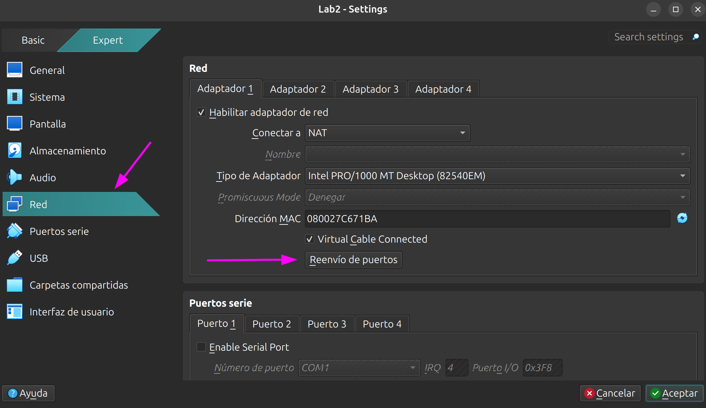
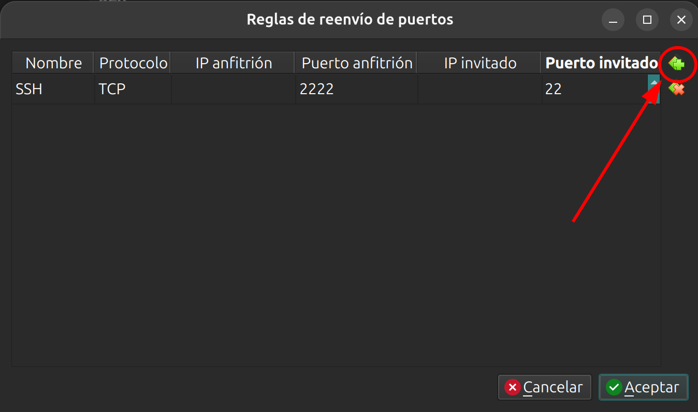
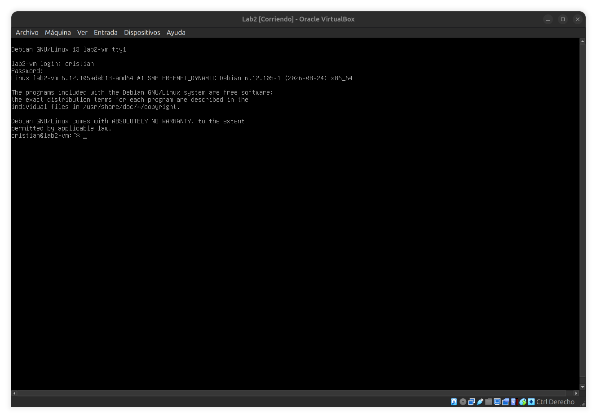
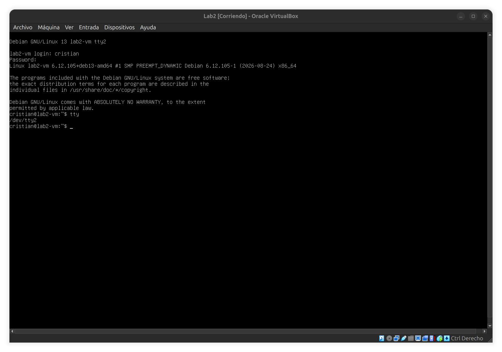

# Laboratorio 3 - Post-instalación y primer acceso por SSH

## Objetivo

- Reconocer a `systemd` como el sistema init que se ejecuta con PID 1.
- Identificar el usuario, sus grupos y el uso de privilegios mediante `sudo`.
- Revisar la configuración inicial de Debian: locale, teclado, zona horaria y hostname.
- Actualizar el sistema mediante APT.
- Configurar el reenvío de puertos de VirtualBox y administrar la VM por SSH.

### En este lab continuaremos con la VM del Laboratorio 2

Vamos a utilizar la VM `Lab2`, con Debian 13, hostname `lab2-vm` y el usuario `cristian`. El laboratorio parte de la instalación realizada en el [Laboratorio 2](../lab2/lab2.md), donde dejamos la cuenta `root` bloqueada y habilitamos el uso de `sudo` para el primer usuario.

> Si elegiste otros nombres o credenciales durante la instalación, reemplazalos en los comandos cuando corresponda.

## 0. Preparación: reenvío de puertos en VirtualBox

La VM utiliza un adaptador de red en modo **NAT**. Este modo le permite acceder a Internet, pero no permite iniciar una conexión desde la máquina anfitriona hacia la VM sin agregar una regla de reenvío de puertos.

La configuración se realiza con la VM **apagada**:

1. En la pantalla principal de VirtualBox, seleccionamos la VM `Lab2` y abrimos **Configuración**.
2. Entramos en **Red** y comprobamos que el **Adaptador 1** esté habilitado y conectado a `NAT`.
3. Hacemos clic en **Reenvío de puertos**.



4. Agregamos una nueva regla con los siguientes valores:

| Nombre | Protocolo | IP Anfitrión | Puerto anfitrión | IP invitado | Puerto invitado |
| :--- | :--- | :--- | :--- | :--- | :--- |
| SSH | TCP |  | 2222 |  | 22 |

Los campos **IP Anfitrión** e **IP invitado** se dejan vacíos.



5. Aceptamos los cambios y cerramos la configuración.

La regla hace que VirtualBox reciba las conexiones dirigidas al puerto `2222` de la máquina anfitriona y las reenvíe al puerto `22` de la VM, donde escucha el servidor SSH.

```text
Anfitrión: localhost:2222  →  VirtualBox NAT  →  VM:22
```

## 1. Iniciar sesión en la consola

1. Iniciamos la VM y esperamos a que aparezca el login en modo texto.
2. Ingresamos en la ventana de VirtualBox con el usuario creado en el Laboratorio 2:

```text
login: cristian
Password: linux410
```

> Al escribir una contraseña, Linux no muestra caracteres ni asteriscos. Es el comportamiento esperado.

El prompt debería tener un formato similar al siguiente:

```text
cristian@lab2-vm:~$
```



### Consolas virtuales

Debian dispone de varias consolas de texto independientes. Primero comprobamos que la sesión inicial corresponde a `tty1`:

```bash
tty
```


En VirtualBox podemos cambiar a otra consola con la tecla anfitriona —por defecto, `Ctrl derecho`— junto con `F2`. En la parte superior de la pantalla veremos que ahora estamos en `tty2`:



Iniciamos sesión nuevamente y comprobamos qué terminal estamos utilizando:

```bash
tty
```

La salida ahora debe ser `/dev/tty2`:


Para regresar a la primera consola utilizamos `Ctrl derecho + F1`. Las consolas locales siguen disponibles si en algún momento no podemos ingresar por SSH.

## 2. Configurar y probar SSH

### 2.1 Verificar el servidor SSH

Antes de conectarnos desde la máquina anfitriona, comprobamos el servicio desde la consola de la VM:

```bash
systemctl status ssh
systemctl is-enabled ssh
sudo ss -tlnp | grep ':22'
```

Resultados esperados:

- El servicio aparece como `active (running)`.
- `systemctl is-enabled ssh` devuelve `enabled`.
- El puerto `22` aparece en estado `LISTEN`.


### 2.2 Primera conexión por SSH

Abrimos una terminal en nuestra laptop, NO dentro de VirtualBox.

- En Windows 10 u 11 podemos utilizar PowerShell.
- En GNU/Linux y macOS utilizamos una terminal.

Nos conectamos mediante el puerto `2222` que configuramos en VirtualBox:

```bash
ssh -p 2222 cristian@localhost
```

La primera vez, el cliente muestra la huella digital del servidor y pregunta si queremos continuar. La comparamos con la obtenida en el paso anterior y, si coincide, escribimos `yes`.

Luego ingresamos la contraseña de tu usuario, en mi caso `cristian`. Si la conexión fue correcta, veremos un prompt similar a:

```text
cristian@lab2-vm:~$
```
Si es la primera vez que te conectas podés recibir un mensaje así:

```bash$ ssh -p 2222 cristian@localhost
The authenticity of host '[localhost]:2222 ([127.0.0.1]:2222)' can't be established.
ED25519 key fingerprint is: SHA256:vrQxMLq5uSpY1Ph8su2vhMxHiXP0iCqVNggyYsXiv9d
This host key is known by the following other names/addresses:
    ~/.ssh/known_hosts:28: [hashed name]
Are you sure you want to continue connecting (yes/no/[fingerprint])? # ponemos yes

yes
Warning: Permanently added '[localhost]:2222' (ED25519) to the list of known hosts.
cristian@localhost's password: # acá pedirá la contraseña


```

Comprobamos que estamos dentro de la VM:

```bash
sudo hostnamectl #Nos pedirá nuevamente la contraseña.
```

Deberíamos ver algo como:
```
$ sudo hostnamectl
[sudo] contraseña para cristian: 
 Static hostname: lab2-vm
       Icon name: computer-vm
         Chassis: vm 🖴
      Machine ID: 32c9da5db360469fbf49d0fc735ef3a9
         Boot ID: d0d17eec7494451cbb85233f61e31a90
    Product UUID: d4b96169-bcfa-bd4c-8180-e12bc22910ce
  Virtualization: oracle
Operating System: Debian GNU/Linux 13 (trixie)                   
          Kernel: Linux 6.12.105+deb13-amd64
    Architecture: x86-64
 Hardware Vendor: innotek GmbH
  Hardware Model: VirtualBox
 Hardware Serial: VirtualBox-6961b9d4-fabc-4cbd-8180-e12bc22910ce
Firmware Version: VirtualBox
   Firmware Date: Fri 2006-12-01
    Firmware Age: 19y 8month 4w 1d    
```


### Si la conexión falla

Revisamos, en este orden:

1. Que la VM esté encendida.
2. Que el servicio SSH esté activo.
3. Que el puerto `22` esté escuchando dentro de la VM.
4. Que la regla de VirtualBox use el puerto anfitrión `2222` y el puerto invitado `22`.
5. Que ningún otro programa de la máquina anfitriona esté utilizando el puerto `2222`.

## 3. Verificar el sistema init y systemd

El kernel inicia un proceso con PID 1 para poner en funcionamiento el espacio de usuario. En Debian, ese sistema init es `systemd`.

1. Consultamos el proceso con PID 1:

```bash
ps -p 1 -o pid,comm,args
```

Deberíamos identificar a `systemd` en la salida.

2. Revisamos el estado general del sistema. Nos mostrará un montón de información sobre los procesos corriendo. Salimos con la tecla `q`.

```bash
systemctl status

```
  


3. Listamos los servicios cargados:

```bash
systemctl list-units --type=service
```

La salida puede abrirse en un paginador. Podemos recorrerla con las flechas y salir con la tecla `q`.

>Recordar ese comando para listar los servicios.

## 4. Usuario, grupos y privilegios

1. Consultamos nuestra identidad y los grupos a los que pertenecemos:

```bash
whoami    # Quienes somos
id        # Mas info sobre nuestro usuario
groups    # Grupos a los que pertenecemos
```

La salida de `groups` debe incluir el grupo `sudo`.


2. Comprobamos el estado de la cuenta root:

```bash
sudo passwd --status root
```

En el segundo campo debería aparecer `L`, que indica que la contraseña de la cuenta está bloqueada.

3. Comparamos la identidad del usuario normal con la de un comando elevado:

```bash
whoami
sudo whoami
```

El primer comando devuelve tu usuario, en mi caso, `cristian` ; el segundo, `root`.

4. Abrimos una sesión de administrador y luego regresamos al usuario normal:

```bash
sudo -i   # Elevamos privilegios
whoami
exit      # Salimos de la "elevación de privilegios"
whoami    # Nuestro usuario
```

Mientras la sesión de administrador está abierta, el último carácter del prompt suele cambiar de `$` a `#`.

> En esta VM, `su -` no permite iniciar una sesión porque root no tiene una contraseña habilitada. Para las tareas administrativas utilizamos `sudo`.

## 5. Configurar locale y teclado

### 5.1 Locale

1. Consultamos la configuración actual:

```bash
locale
```

2. Generamos y seleccionamos el locale del laboratorio:

```bash
sudo dpkg-reconfigure locales
```

En la pantalla de selección:


- Si aparece seleccionada `es_AR.UTF-8 UTF-8`, presionamos la tecla `tab` dos veces y luego presionar `enter` sobre `<Cancelar>` y nos saltamos al punto [6](#6-identificar-el-sistema).
- Si aparece otra opción:
  - Marcamos `es_AR.UTF-8 UTF-8` con la barra espaciadora.
  - Confirmamos con `Enter`.
  - Elegimos `es_AR.UTF-8` como locale predeterminado.

3. Cerramos la sesión y volvemos a ingresar para que todas las variables se actualicen:

```bash
exit
```

Desde la terminal de la máquina anfitriona, volvemos a conectarnos:

```bash
ssh -p 2222 cristian@localhost
```

Después del nuevo login, verificamos:

```bash
locale
```

Deberíamos ver `LANG=es_AR.UTF-8`.

## 6. Identificar el sistema

Continuamos desde la sesión SSH.

Antes de realizar cambios, identificamos el servidor:

```bash
cat /etc/os-release      # distribución y versión
uname -a                 # kernel y arquitectura
hostnamectl              # hostname, sistema operativo y kernel
lsblk                    # discos y particiones
ip a                     # interfaces y direcciones de red
```

Estas consultas son especialmente importantes cuando administramos varias máquinas con terminales similares.


## 7. Configurar hora y zona horaria

1. Consultamos el estado actual:

```bash
timedatectl
```

2. Configuramos la zona horaria y habilitamos la sincronización automática:

```bash
sudo timedatectl set-timezone America/Argentina/Buenos_Aires
sudo timedatectl set-ntp true
```

3. Verificamos el resultado:

```bash
timedatectl
```

La salida debe mostrar la zona `America/Argentina/Buenos_Aires` y la sincronización de red habilitada. La confirmación efectiva de sincronización puede demorar unos instantes.

## 8. Actualizar el sistema

Primero actualizamos la información de paquetes disponibles:

```bash
sudo apt update
```

Después instalamos las actualizaciones:

```bash
sudo apt upgrade
```

APT muestra los paquetes que va a modificar y solicita confirmación antes de continuar.

> `apt update` no instala actualizaciones: solamente descarga la información más reciente de los repositorios configurados. `apt upgrade` utiliza esa información para actualizar los paquetes instalados.

## Resumen de Lab

En este laboratorio configuramos el reenvío de los puertos `2222` a `22` en VirtualBox y realizamos la primera conexión SSH desde la máquina anfitriona. Desde esa sesión revisamos el sistema init de Debian y comprobamos que systemd se ejecuta como PID 1. También identificamos al usuario y sus grupos, utilizamos `sudo` para elevar privilegios, verificamos que la cuenta root permanece bloqueada, completamos la configuración regional, el teclado, la zona horaria y el hostname, y actualizamos el sistema con APT.

## Links útiles y referencias

- [Apuntes teóricos del curso](https://linux.idepba.com.ar/)
- [Laboratorio 2 - Instalación de Debian 13](../lab2/lab2.md)
- [Debian Reference - Inicialización del sistema](https://www.debian.org/doc/manuals/debian-reference/ch03.en.html)
- [Debian Reference - La cuenta root](https://www.debian.org/doc/manuals/debian-reference/ch01.en.html#_the_root_account)
- [Debian Wiki - Locale](https://wiki.debian.org/Locale)
- [Debian Wiki - Keyboard](https://wiki.debian.org/Keyboard)
- [Debian Wiki - DateTime](https://wiki.debian.org/DateTime)
- [Debian Wiki - sudo](https://wiki.debian.org/sudo)
- [Debian Wiki - SSH](https://wiki.debian.org/SSH)
- [Manual de OpenSSH - `ssh(1)`](https://man.openbsd.org/ssh)
- [VirtualBox - Reenvío de puertos con NAT](https://www.virtualbox.org/manual/ch06.html#natforward)

-----

<p align="center">

</p>
